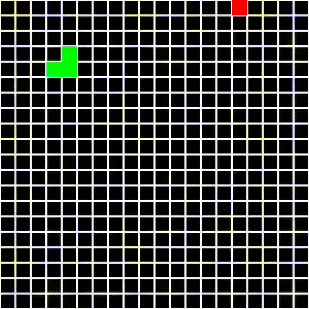

# Snake

This repo contains python implementation of snake game as well as keras model trained to play it. The model was trained by DQN algorithm and is a cnn which considers last 3 frames of game enviroment in order to produce decision for the next frame. Although this cnn is not ideal(and is in fact beaten by simple greedy algotihm which just goes by the shortest path to the food), it demonstrated signs of rational "thinking" when being tested. Futher improvement may be achieved by training a deeper network with smaller kernels, increasing length of training(this model was trained on 500k frames, although around 1M is recommended; moreover majority of training frames was spent on exploration not exploitation) or by adjusting rewards and punishments system.

<!--  -->

CNN | Greedy
:-------------------------:|:-------------------------:
  |  
